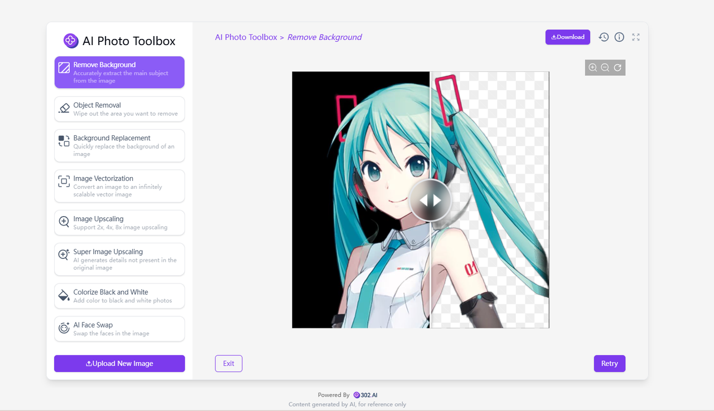

# 
🖼️ AI Image Toolbox 🚀✨

The AI image toolbox offers a variety of rich AI image processing functions and also enables continuous chained operations.

<a href="README_zh.md">中文</a> | <a href="README.md">English</a> | <a href="README_ja.md">日本語</a>

   

This is the open-source version of the [AI Image Toolbox](https://302.ai/en/tools/pictool/) from [302.AI](https://302.ai). You can directly log in to 302.AI to use the online version with zero code and zero background, or modify and deploy it yourself according to your requirements.

## Interface Preview
You can upload pictures or input descriptions, choose a model to generate pictures and then conduct picture processing. Multiple picture processing functions are available for selection.
    

Taking the background removal function as an example, based on the uploaded pictures, the AI automatically identifies the background and removes it.

## Project Features

### 🎥 AI Image Toolbox
It supports a variety of image operations, including the extended functions of generating images from text and converting images into videos.
### 🖼️ All-inclusive Functions
It includes functions such as background removal, object elimination, background replacement, image vectorization, image enlargement, super image enlargement, colorizing black-and-white images, AI face swapping, image expansion, image modification, generating images from existing images, generating images from drafts, image cropping, image color adjustment, image splicing, and portrait filters.
### 🔄 Task Management
Tasks support regeneration, chained tool calls, historical rollback for re-editing.
### ⚙️ Multi-Model Support
You can choose various models to generate images and videos.
### 📜 History Records
Save your creative history, memory never lost, downloadable anytime, anywhere.
### 🌍 Multi-language Support
- Chinese Interface
- English Interface
- Japanese Interface

## 🚩 Future Update Plans
- [ ] Add functions such as special effects, image restoration, and image composition

## Technology Stack

- Next.js 14 basic framework
- Tailwind CSS + Shadcn UI style UI
- Zustand for data management

## Development & Deployment

1. Clone the project `git clone git@github.com:302ai/302_image_toolbox.git`
2. Install dependencies `pnpm install`
3. Configure the 302 API KEY by referring to .env.example
4. Run the project `pnpm dev`
5. Build and deploy `docker build -t image_toolbox . && docker run -p 3000:3000 image_toolbox`

## ✨ Introduction to 302.AI ✨

[302.AI](https://302.ai) is an enterprise-oriented AI application platform that offers pay-as-you-go services, ready-to-use solutions, and an open-source ecosystem.✨

1. 🧠 It aggregates the latest and most comprehensive AI capabilities and brands, including but not limited to language models, image models, sound models, and video models.
2. 🚀 Deep application development on basic models, we develop real AI products, not simple chatbots.
3. 💰 Zero monthly fee, all features are pay-as-you-go, fully open, achieving genuinely low barriers and high ceilings.
4. 🛠 Powerful management backend, aimed at teams and small to medium-sized enterprises, managed by one person, used by many.
5. 🔗 All AI capabilities provide API access, all tools can be self-customized (in progress).
6. 💡 A strong development team launching 2-3 new applications weekly, with daily product updates. Developers interested in joining are welcome to contact us.
