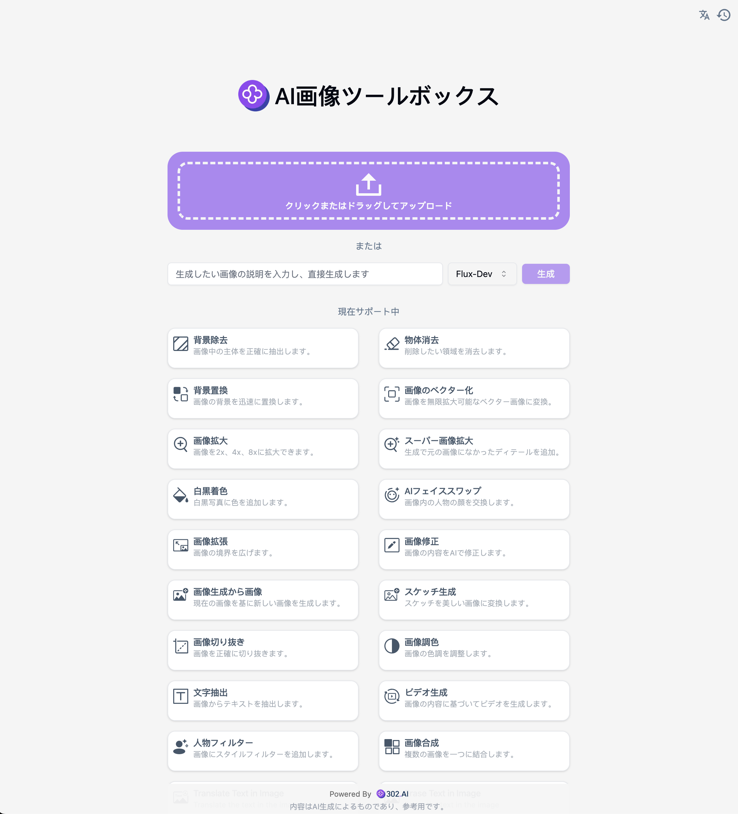

# 
🖼️ AI画像ツールボックス 🚀✨

AI 画像ツールボックスは、さまざまな豊富な AI 画像処理機能を提供し、連続的なチェーン操作も可能です。

<a href="README_zh.md">中文</a> | <a href="README.md">English</a> | <a href="README_ja.md">日本語</a>

 

これは[302.AI](https://302.ai/ja/)の[AI画像ツールボックス](https://302.ai/product/detail/29)オープンソース版です。302.AIに直接ログインし、コード不要でオンライン版を使用するか、自分のニーズに合わせて変更して自分でデプロイすることができます。

## インターフェースプレビュー
画像をアップロードするか説明を入力することで、モデルを選択して画像を生成した後、画像処理を行うことができます。複数の画像処理機能が選択可能です。
     

背景除去機能を例にとると、アップロードした画像に基づいて、AI が自動的に背景を識別して除去します。

## プロジェクトの特徴

### 🎥 AI画像ツールボックス
複数の画像操作をサポートしており、テキストから画像を生成する拡張機能や画像をビデオに変換する機能も含まれています。
### 🖼️ 機能が充実している
背景除去、物体除去、背景置換、画像のベクトル化、画像拡大、スーパー画像拡大、白黒画像の着色、AI による顔交換、画像拡張、画像修正、既存画像から画像を生成する、下書きから画像を生成する、画像の切り抜き、画像の色調整、画像の結合、人物用フィルターなどの機能が含まれています。
### 🔄 タスク管理
タスクは再生成をサポートし、さまざまなツールの連鎖呼び出し、履歴のロールバックで再編集が可能です。
### ⚙️ 複数モデルのサポート
画像やビデオを生成するために、さまざまなモデルを選択することができます。
### 📜 履歴記録
創作履歴を保存し、記憶が失われず、いつでもどこでもダウンロードできます。
### 🌍 多言語サポート
- 中国語インターフェース
- 英語インターフェース
- 日本語インターフェース

## 🚩 将来のアップデート計画
- [ ] 特殊効果、画像修復、画像合成などの機能を追加する。

## 技術スタック

- Next.js 14 基盤フレームワーク
- Tailwind CSS + Shadcn UI スタイルUI
- Zustand をデータ管理に使用

## 開発&デプロイ

1. プロジェクトをクローン `git clone git@github.com:302ai/302_image_toolbox.git`
2. 依存関係をインストール `npm install`
3. 302のAPI KEYを設定 `.env.example`を参照
4. プロジェクトを実行 `npm run dev`
5. パッケージングとデプロイ `docker build -t image_toolbox . && docker run -p 3000:3000 image_toolbox`

## ✨ 302.AI紹介 ✨

[302.AI](https://302.ai)は企業向けのAIアプリケーションプラットフォームであり、必要に応じて支払い、すぐに使用できるオープンソースのエコシステムです。✨

1. 🧠 最新かつ包括的なAI能力とブランドを集結し、言語モデル、画像モデル、音声モデル、ビデオモデルを含みます。
2. 🚀 基礎モデル上で高度なアプリケーション開発を行い、単なるチャットボットではない真正のAI製品を開発します。
3. 💰 月額料金なし、すべての機能は従量課金で全面開放され、真のハードル低く、上限高を実現します。
4. 🛠 強力な管理バックエンドを備えており、チームや中小企業向けに一人が管理し、複数人が使用できます。
5. 🔗 すべてのAI能力はAPI接続を提供し、すべてのツールはオープンソースで独自にカスタマイズ可能（進行中）。
6. 💡 強力な開発チームがあり、毎週2〜3の新しいアプリケーションをリリースし、製品を毎日更新します。興味のある開発者の参加も歓迎します。
